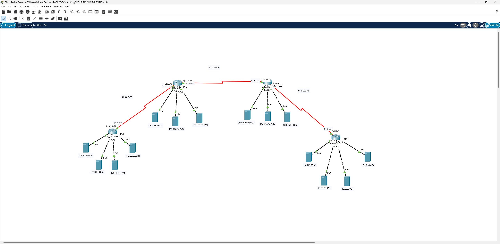

# Route Summarization – تلخيص المسارات (Route Summarization)

## 📖 الوصف
مشروع يطبق مفهوم **تلخيص المسارات (Route Summarization / Supernetting)** — تجميع عدة شبكات فرعية متجاورة في مسار واحد ملخّص لتقليل حجم جداول التوجيه وتحسين أداء الشبكة.

## 🗺️ التصميم (Topology)

الشبكة تتكون من 4 راوترات رئيسية مرتبطة عبر روابط WAN (`41.0.0.0/30`, `51.0.0.0/30`, `61.0.0.0/30`)، وكل راوتر يخدم عدة شبكات LAN فرعية:

- **الراوتر الأيسر العلوي**: يخدم شبكات `192.168.5.0/24`, `192.168.15.0/24`, `192.168.25.0/24` بالإضافة لراوتر فرعي يخدم `172.30.20.0/24`, `172.30.30.0/24`, `172.30.40.0/24`, `172.30.50.0/24`
- **الراوتر الأيمن العلوي**: يخدم شبكات `200.150.10.0/24`, `200.150.20.0/24`, `200.150.100.0/24`
- **الراوتر الأيمن السفلي**: يخدم شبكات `10.20.5.0/24`, `10.20.10.0/24`, `10.20.20.0/24`, `10.20.30.0/24`

## ⚙️ المفاهيم المطبقة
- حساب المسار الملخّص (Summary Route) لمجموعة شبكات متجاورة بدلاً من الإعلان عن كل شبكة على حدة
- تقليل حجم جداول التوجيه (Routing Table Size) وتسريع البحث فيها
- تطبيق التلخيص على مسارات ساكنة (Static Summarization) بين الراوترات

## 🎯 الهدف من المشروع
فهم كيفية تقليل تعقيد جداول التوجيه في الشبكات الكبيرة عبر حساب أقنعة الشبكة الملخّصة (Summary Mask) التي تغطي عدة شبكات فرعية بسطر واحد، وهو مهارة أساسية في تصميم الشبكات الكبيرة.

## 📂 الملف
- [`Route-Summarization.pkt`](./Route-Summarization.pkt) — ملف Packet Tracer الكامل
